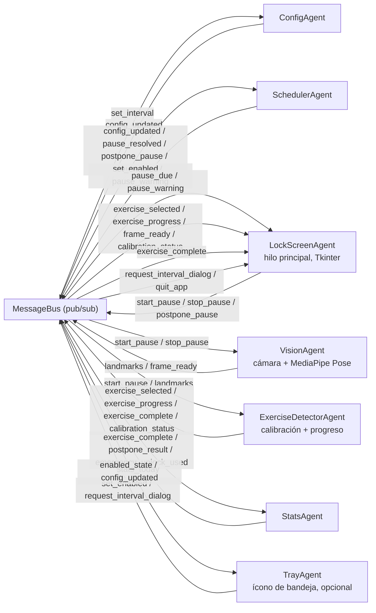

# Pausa Activa — Sistema Multiagente para Programadores

Bloquea la pantalla cada cierto tiempo y solo la desbloquea cuando, a través
de la cámara, detecta que hiciste un ejercicio (sentadillas, saltos de
tijera o estiramiento de brazos) durante 1 minuto acumulado. Usa
**Google MediaPipe** para estimar la pose corporal en tiempo real.

## Arquitectura multiagente

El sistema no tiene un flujo lineal: son **7 agentes autónomos**, cada uno en
su propio hilo, que solo se comunican publicando y suscribiéndose a mensajes
en un `MessageBus` compartido (patrón pub/sub). Ningún agente llama
directamente a otro.



| Agente                  | Rol                                                                    | Escucha                                                                                                                                                                                            | Publica                                                                                                  |
| ----------------------- | ---------------------------------------------------------------------- | -------------------------------------------------------------------------------------------------------------------------------------------------------------------------------------------------- | -------------------------------------------------------------------------------------------------------- |
| `ConfigAgent`           | Dueño de `config.json`                                                 | `set_interval`                                                                                                                                                                                     | `config_updated`                                                                                         |
| `SchedulerAgent`        | Temporizador, aviso previo y posposiciones limitadas                   | `config_updated`, `pause_resolved`, `postpone_pause`, `set_enabled`                                                                                                                                | `pause_due`, `pause_warning`, `tick`, `postpone_result`, `enabled_state`                                 |
| `VisionAgent`           | Cámara + MediaPipe Pose                                                | `start_pause`, `stop_pause`                                                                                                                                                                        | `landmarks`, `frame_ready`                                                                               |
| `ExerciseDetectorAgent` | Calibra encuadre, elige ejercicio y mide progreso                      | `start_pause`, `stop_pause`, `landmarks`                                                                                                                                                           | `exercise_selected`, `exercise_progress`, `exercise_complete`, `calibration_status`                      |
| `StatsAgent`            | Persiste estadísticas diarias (`data/stats.json`)                      | `exercise_complete`, `postpone_result`, `emergency_unlock_used`, `request_stats_today`                                                                                                             | `stats_today`                                                                                            |
| `TrayAgent` (opcional)  | Ícono de bandeja: pausar programa, ver stats, cambiar intervalo, salir | `enabled_state`, `config_updated`                                                                                                                                                                  | `set_enabled`, `request_interval_dialog`, `set_interval`, `quit_app`                                     |
| `LockScreenAgent`       | Bloqueo de pantalla y aviso previo (UI)                                | `pause_due`, `pause_warning`, `exercise_selected`, `exercise_progress`, `exercise_complete`, `frame_ready`, `tick`, `postpone_result`, `calibration_status`, `request_interval_dialog`, `quit_app` | `start_pause`, `stop_pause`, `pause_resolved`, `postpone_pause`, `set_interval`, `emergency_unlock_used` |

Cada ejercicio (`exercises/squats.py`, `jumping_jacks.py`, `arm_raises.py`)
implementa la misma interfaz (`BaseExercise`), así que **agregar un nuevo
ejercicio es agregar un archivo nuevo** y registrarlo en
`agents/exercise_detector_agent.py`, sin tocar el resto del sistema. Son
funciones puras (landmarks + dt → progreso), por eso se prueban con
landmarks sintéticos en `test/test_exercises.py`, sin necesitar cámara.

## Flujo de una pausa

1. Cuando faltan 20s (`WARNING_SECONDS`), `SchedulerAgent` publica
   `pause_warning`. `LockScreenAgent` muestra un aviso pequeño, no
   bloqueante, en la esquina superior derecha, con la cuenta atrás y un
   botón **"Posponer 10 min"** (máximo 2 veces al día).
2. `SchedulerAgent` cumple el intervalo configurado → publica `pause_due`.
3. `LockScreenAgent` cierra el aviso y abre una ventana a pantalla completa
   que **cubre todos los monitores conectados**, siempre encima, sin botón
   de cerrar funcional (`grab_set` captura todo el input) → publica
   `start_pause`.
4. `VisionAgent` enciende la cámara y por cada frame publica los 33
   landmarks de MediaPipe Pose (`landmarks`) y el frame anotado con el
   esqueleto (`frame_ready`).
5. `ExerciseDetectorAgent` primero **calibra**: espera ~1s continuo con el
   torso, caderas, rodillas y tobillos visibles (si no, `LockScreenAgent`
   muestra "No te veo bien..."). Una vez calibrado, elige un ejercicio al
   azar y, con cada `landmarks`, acumula segundos de movimiento correcto y
   cuenta repeticiones → `exercise_progress`.
6. Al llegar a 60 segundos activos, publica `exercise_complete`.
   `StatsAgent` registra la pausa cumplida en `data/stats.json`.
7. `LockScreenAgent` cierra la ventana y publica `stop_pause` +
   `pause_resolved`, lo que hace que `SchedulerAgent` reinicie el conteo.

### Botón de emergencia

Si la cámara falla o algo se cuelga a mitad de un ejercicio, mantener
**Ctrl + Shift + Esc presionado 5 segundos** fuerza el desbloqueo. Queda
registrado en el log y en las estadísticas del día (`emergency_unlocks`)
para poder ver si se está abusando de él.

## Instalación (Windows)

```bash
python -m venv venv
venv\Scripts\activate
pip install -r requirements.txt
```

`pystray` (ícono de bandeja) es opcional: si no lo instalas, el programa
funciona igual y simplemente no aparece el ícono.

## Ejecutar

```bash
python main.py
```

Al iniciar te preguntará cada cuántos minutos quieres la pausa (queda
guardado en `config.json` para la próxima vez). El programa debe quedar
corriendo en segundo plano para que las pausas salten automáticamente.

### Arranque automático con Windows

```bash
python scripts/add_to_startup.py            # instala
python scripts/add_to_startup.py --remove   # desinstala
```

Esto agrega una entrada en `HKCU\...\CurrentVersion\Run` que usa
`pythonw.exe` (sin consola visible) apuntando a `main.py`.

### Ícono en la bandeja del sistema

Con `pystray` instalado, aparece un ícono con menú para:

- **Pausar/reanudar el programa** (útil antes de una videollamada, sin
  cerrar la app del todo).
- **Cambiar el intervalo** sin reiniciar (abre el mismo diálogo del
  arranque, pero en caliente).
- **Ver estadísticas de hoy** (pausas cumplidas, pospuestas, desbloqueos de
  emergencia).
- **Salir**.

## Logging

Los agentes usan el módulo estándar `logging` (no `print`). Los logs quedan
en consola y en `data/logs/pausa_activa.log` (rotativo, hasta 3 archivos de
1MB), configurado una sola vez en `core/logging_config.py`.

## Tests

```bash
pip install pytest --break-system-packages   # o dentro del venv, sin la bandera
python -m pytest test/
```

Cubren geometría (`test_geometry.py`), la lógica de cada ejercicio con
landmarks sintéticos (`test_exercises.py`), el límite diario de
posposiciones (`test_scheduler_postpone.py`) y la persistencia de
estadísticas (`test_stats_store.py`). Ninguno necesita cámara, MediaPipe ni
Tkinter.

## Nota sobre MediaPipe

Las versiones recientes de `mediapipe` (>=0.10, incluida toda la serie
1.0.x) **eliminaron la API antigua** `mp.solutions.pose`. Este proyecto usa
la **Tasks API** (`mediapipe.tasks.vision.PoseLandmarker`), que es la
soportada actualmente. La primera vez que ejecutes `python main.py`, el
programa descarga automáticamente el modelo `pose_landmarker_lite.task`
(unos pocos MB) a la carpeta `models/` — necesitas internet solo esa
primera vez; después queda cacheado en disco. `requirements.txt` fija la
versión exacta (`mediapipe==0.10.14`) para que una actualización futura no
vuelva a romper la Tasks API sin aviso.

## Límites conocidos

- **No reemplaza el lock screen de Windows**: es una ventana de aplicación
  a pantalla completa y siempre-encima con captura de input
  (`grab_set`/`topmost`), suficiente para impedir el uso normal del equipo,
  pero **no puede bloquear atajos reservados por el sistema operativo**
  como `Ctrl+Alt+Supr` o el cambio rápido de usuario — ninguna app de
  usuario en Windows puede hacerlo.
- Requiere buena iluminación y que el cuerpo completo (o al menos torso y
  piernas) sea visible por la cámara para que MediaPipe detecte los
  landmarks con confianza; por eso existe la calibración inicial.
- El criterio de desbloqueo es tiempo en movimiento correcto (60s
  acumulados), no solo repeticiones, para evitar que alguien "haga trampa"
  quedándose en una postura estática.
- El desbloqueo de emergencia detecta el combo por eventos de teclado de
  Tkinter (press/release), no por polling de bajo nivel del sistema
  operativo; en la inmensa mayoría de teclados y configuraciones funciona
  bien, pero no es 100% infalible si el foco de la ventana se pierde.
- `TrayAgent`/pystray fue pensado y probado mentalmente para Windows; en
  macOS, pystray requiere que el ícono corra en el hilo principal, lo cual
  chocaría con Tkinter (que ya ocupa ese hilo aquí). En Windows no hay ese
  problema.
- El multi-monitor usa la API de Windows (`GetSystemMetrics` vía `ctypes`)
  para cubrir todo el escritorio virtual; en Linux/Mac se degrada
  automáticamente a cubrir solo el monitor principal.

## Extender

- **Nuevo ejercicio**: crea una clase en `exercises/` que herede de
  `BaseExercise` e impleméntala en `EXERCISES` dentro de
  `agents/exercise_detector_agent.py`.
- **Más estadísticas**: `StatsAgent`/`StatsStore` ya separan "qué se
  guarda" de "cómo se guarda"; agregar un campo nuevo es un `increment()`
  más desde donde corresponda.
- **Otra UI para el aviso previo o las estadísticas** (ej. notificación
  nativa de Windows con `win10toast` en vez de una ventana Tkinter): basta
  con suscribirse a `pause_warning` / `stats_today` en un agente nuevo, sin
  tocar `SchedulerAgent` ni `StatsAgent`.

## Wiki MCP del proyecto

El servidor MCP expone la wiki Markdown del proyecto para que un arnés pueda
consultarla y ampliarla. Es independiente del proceso de pausas activas.

```powershell
python -m venv venv
venv\Scripts\Activate.ps1
pip install -r requirements.txt
python -m wiki_mcp.server
```

VS Code puede iniciarlo automáticamente desde `.vscode/mcp.json` una vez
instaladas las dependencias. La wiki está en `wiki/`: el recurso
`wiki://index` es su punto de entrada, `listar_conceptos` enumera las notas
de `wiki/conceptos/` y `crear_concepto` crea una nota nueva sin sobrescribir
otra existente.

Para clientes HTTP, inicia el transporte Streamable HTTP:

```powershell
python -m wiki_mcp.server --transport streamable-http --host 127.0.0.1 --port 8765
```

El endpoint MCP queda en `http://127.0.0.1:8765/mcp`. El servidor se enlaza
por defecto a `127.0.0.1`; usa otra interfaz solo si necesitas acceso remoto
y puedes proteger ese acceso.

Las reglas de trabajo están en `AGENTS.md`. El registro local está en
`📋 Proyectos/Pausa Activa.md` y el índice de habilidades en
`INDICE_DE_SKILLS.md`.
