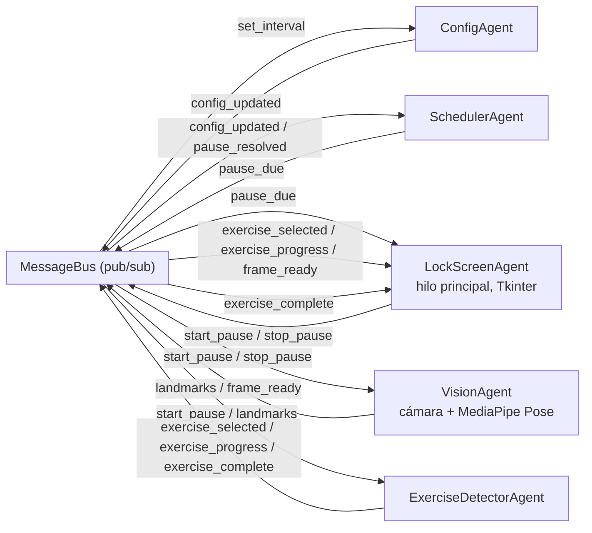

# Pausa Activa — Sistema Multiagente para Programadores

Bloquea la pantalla cada cierto tiempo y solo la desbloquea cuando, a través
de la cámara, detecta que hiciste un ejercicio (sentadillas, saltos de
tijera o estiramiento de brazos) durante 1 minuto acumulado. Usa
**Google MediaPipe** para estimar la pose corporal en tiempo real.

## Arquitectura multiagente

El sistema no tiene un flujo lineal: son **5 agentes autónomos**, cada uno en
su propio hilo, que solo se comunican publicando y suscribiéndose a mensajes
en un `MessageBus` compartido (patrón pub/sub). Ningún agente llama
directamente a otro.



| Agente | Rol | Escucha | Publica |
|---|---|---|---|
| `ConfigAgent` | Dueño de `config.json` | `set_interval` | `config_updated` |
| `SchedulerAgent` | Temporizador | `config_updated`, `pause_resolved` | `pause_due`, `tick` |
| `VisionAgent` | Cámara + MediaPipe Pose | `start_pause`, `stop_pause` | `landmarks`, `frame_ready` |
| `ExerciseDetectorAgent` | Elige ejercicio y mide progreso | `start_pause`, `stop_pause`, `landmarks` | `exercise_selected`, `exercise_progress`, `exercise_complete` |
| `LockScreenAgent` | Bloqueo de pantalla (UI) | `pause_due`, `exercise_selected`, `exercise_progress`, `exercise_complete`, `frame_ready` | `start_pause`, `stop_pause`, `pause_resolved` |

Cada ejercicio (`exercises/squats.py`, `jumping_jacks.py`, `arm_raises.py`)
implementa la misma interfaz (`BaseExercise`), así que **agregar un nuevo
ejercicio es agregar un archivo nuevo** y registrarlo en
`agents/exercise_detector_agent.py`, sin tocar el resto del sistema.

## Flujo de una pausa

1. `SchedulerAgent` cumple el intervalo configurado → publica `pause_due`.
2. `LockScreenAgent` abre una ventana a pantalla completa, siempre encima,
   sin botón de cerrar funcional (`grab_set` captura todo el input) →
   publica `start_pause`.
3. `VisionAgent` enciende la cámara y por cada frame publica los 33
   landmarks de MediaPipe Pose (`landmarks`) y el frame anotado con el
   esqueleto (`frame_ready`).
4. `ExerciseDetectorAgent` elige un ejercicio al azar (sentadillas / saltos
   de tijera / estiramiento) y, con cada `landmarks`, acumula segundos de
   movimiento correcto y cuenta repeticiones → `exercise_progress`.
5. Al llegar a 60 segundos activos, publica `exercise_complete`.
6. `LockScreenAgent` cierra la ventana y publica `stop_pause` +
   `pause_resolved`, lo que hace que `SchedulerAgent` reinicie el conteo.

## Instalación (Windows)

```bash
python -m venv venv
venv\Scripts\activate
pip install -r requirements.txt
```

## Ejecutar

```bash
python main.py
```

Al iniciar te preguntará cada cuántos minutos quieres la pausa (queda
guardado en `config.json` para la próxima vez). El programa debe quedar
corriendo en segundo plano (por ejemplo, minimizado o como tarea programada
de inicio) para que las pausas salten automáticamente.

## Nota sobre MediaPipe

Las versiones recientes de `mediapipe` (>=0.10, incluida toda la serie
1.0.x) **eliminaron la API antigua** `mp.solutions.pose`. Este proyecto usa
la **Tasks API** (`mediapipe.tasks.vision.PoseLandmarker`), que es la
soportada actualmente. La primera vez que ejecutes `python main.py`, el
programa descarga automáticamente el modelo `pose_landmarker_lite.task`
(unos pocos MB) a la carpeta `models/` — necesitas internet solo esa
primera vez; después queda cacheado en disco.

## Límites conocidos

- **No reemplaza el lock screen de Windows**: es una ventana de aplicación
  a pantalla completa y siempre-encima con captura de input
  (`grab_set`/`topmost`), suficiente para impedir el uso normal del equipo,
  pero **no puede bloquear atajos reservados por el sistema operativo**
  como `Ctrl+Alt+Supr` o el cambio rápido de usuario — ninguna app de
  usuario en Windows puede hacerlo.
- Requiere buena iluminación y que el cuerpo completo (o al menos torso y
  piernas) sea visible por la cámara para que MediaPipe detecte los
  landmarks con confianza.
- El criterio de desbloqueo es tiempo en movimiento correcto (60s
  acumulados), no solo repeticiones, para evitar que alguien "haga trampa"
  quedándose en una postura estática.

## Extender

- **Cambiar el intervalo en caliente**: ya existe el mensaje `set_interval`
  → `config_updated`; solo falta una UI (por ejemplo, un ícono en la
  bandeja del sistema) que lo publique.
- **Nuevo ejercicio**: crea una clase en `exercises/` que herede de
  `BaseExercise` e impleméntala en `EXERCISES` dentro de
  `agents/exercise_detector_agent.py`.
- **Persistir estadísticas** (pausas cumplidas por día, racha, etc.): un
  nuevo agente `StatsAgent` suscrito a `exercise_complete` y `pause_due`,
  sin tocar nada más.
